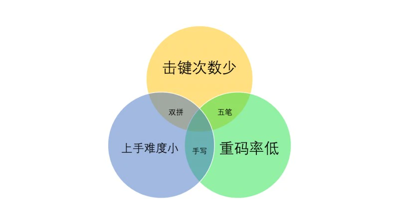
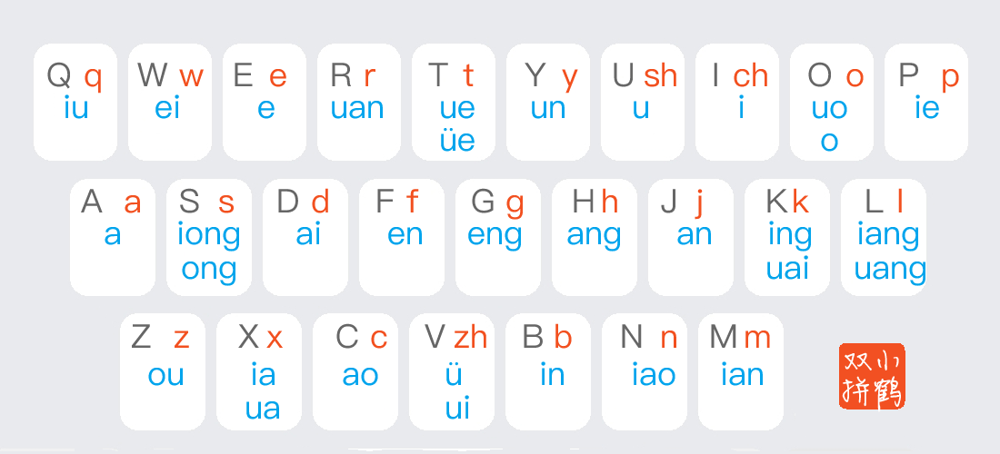
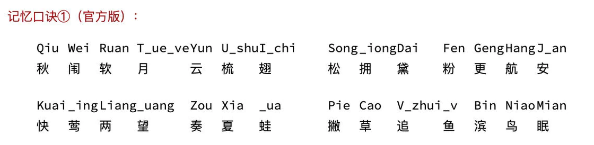

# 使用两年半后，我仍然推荐你学双拼输入法

> 对于一个原来没有学习过双拼的用户来说，学习双拼最大的困难其实并不是韵母键位的记忆难度，20多个韵母键位的记忆量，无论方案如何也就是小时上的差别，学习双拼的最大难度其实是全拼到双拼节奏上的变化，这点在最初的一周内是比较痛苦的，退堂鼓也多是在这一周内打出的，一周后你基本就算度过了这个困难期。所以如果你打算学习双拼的话至少要坚持一周，不然的话干脆别学。如果你是其他双拼方案的使用者，你在转为小鹤双拼之前，我想你应该思考一个问题：你对原来的方案有什么不满吗？如果无，建议你就别转了，如果你坚持要转，那么希望你能坚持一个月，双拼方案的转换难度主要是以前方案的记忆干扰，这点甚至比原来是全拼的初学者更难。
>

## 常见的三种输入法对比？
先解释几个名词：
- **重码率**：不同的汉字或词组具有相同的编码的概率，比如「编程」和「变成」都对应同样的编码「BianCheng」。
- **击键次数**：平均每个字所击打键盘的次数。
- **上手难度**：从接触到完全熟练使用所花费的时间成本。

**手写输入**：上手难度小，可谓是最入门的解决方案，会写字，就能上手；重码率低，不写错，就不会有重码。

**五笔输入**：重码率极低，击键次数也少，可谓效率最佳；学习门槛高，常常会使学习者有种「步子迈大了，咔」的挫败感，目前大多存活在 90 年代第一波接触电脑的人中。

**双拼输入**：上手难度小，但比手写高一点，起码得会拼音；击键次数少，两键一字；重码率一般。

## 双拼vs全拼

双拼本质上是一种改良的拼音输入法，和全拼相比，它把超过一个字母的声母和韵母安排到了一个特定的按键上，达成所有字的拼音都只用两个字母就能拼写的效果。和全拼输入法「认读 - 输入拼音 - 翻页 - 选字」的流程相比，它只是把「输入拼音」的过程从 1~6 次击键固定到 2 次击键，让击键的节奏更加整齐。打字时，适当的节奏可以让输出变得更加流畅。而得益于拼音里一次击键就能完成的字还算少数，在大多数时候，双拼是可以减少击键次数的。

- **击键次数更少**：「中华人民共和国」这七个字需要「ZhongHuaRenMinGongHeGuo」23 次输入，而双拼输入法，只需要「VsHxRfMbGsHeGo」14 次击键就已足够。即使算上智能联想，双拼的声母也可以简化全拼中诸如 sh、ch 等的按键次数。
- **上手难度不高**：输入流程和全拼基本一致，只需要多掌握韵母词汇表。

## 小鹤双拼介绍

小鹤双拼使用两个字母对汉字进行编码的方案，第一个字母表示声母，第二字母表示韵母，没有声母时用零声母代替，单字母声母韵母键位不变

> 双拼键位图：

为了方便记忆，小鹤双拼让每个按键对应的声母和其中一个韵母能组合成有意义的汉字发音。
> 记忆口诀(官方版):

有一些汉字没有声母（零声母），这种情况只要会全拼输入法就可以一秒解决：

单字母韵母，如： 啊＝aa 哦=oo 额=ee

双字母韵母，如： 爱＝ai 恩=en 欧=ou

三字母韵母，零声母+韵母所在键，如： 昂＝ah

### 支持平台
- **iOS/MacOS**：系统默认输入法支持小鹤双拼，在设置里选择即可
- **Windows**：win支持双拼输入法，但是没有小鹤双拼，需要自行配置，可以参考[这里](https://github.com/2015WUJI01/xhup-for-win10)一键配置
- **Android**：可以下载百度、搜狗输入法来使用小鹤双拼

## 参考文档

 - [小鹤双拼文档](https://flypy.com/help/#/up)